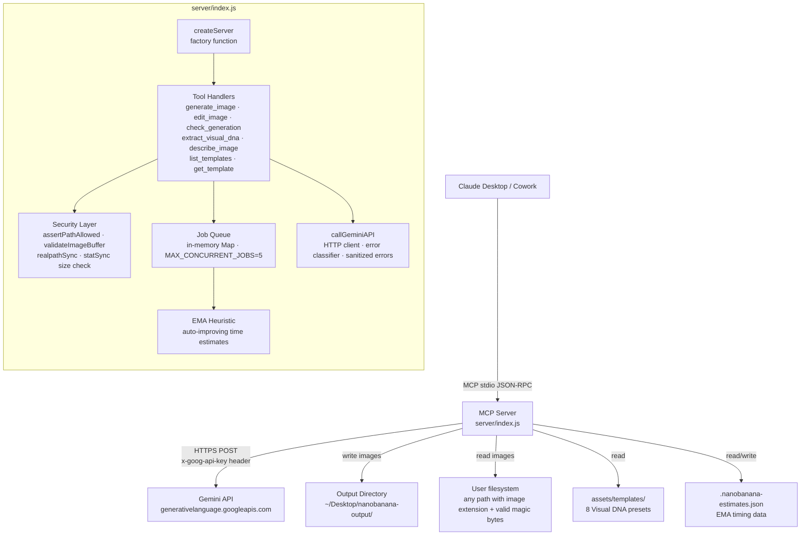
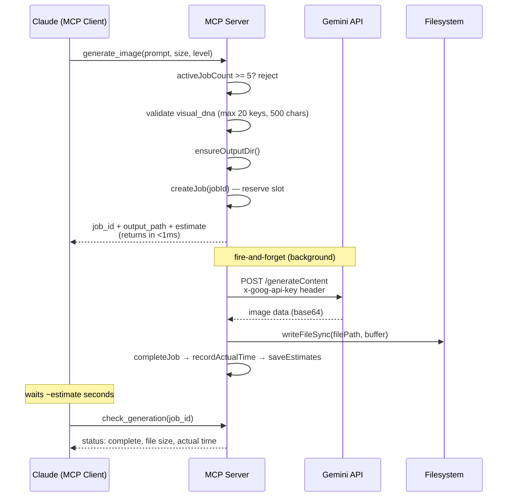
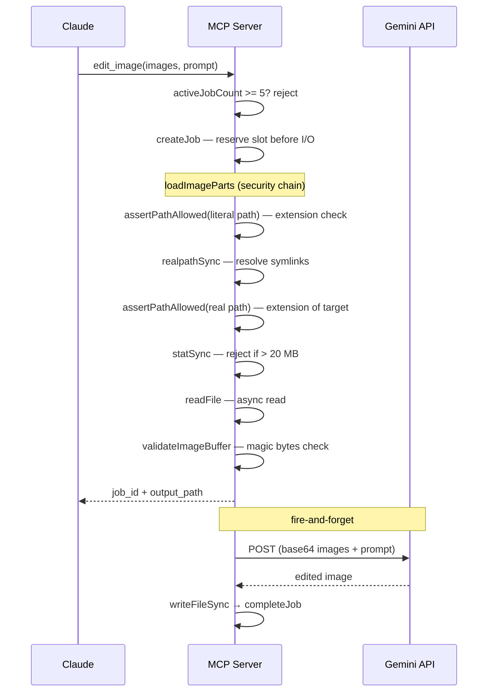
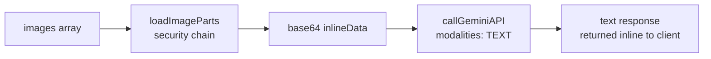
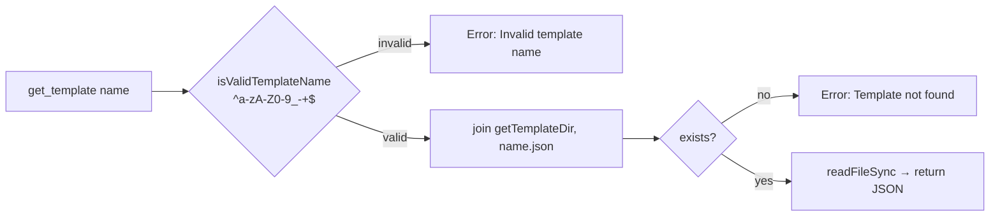
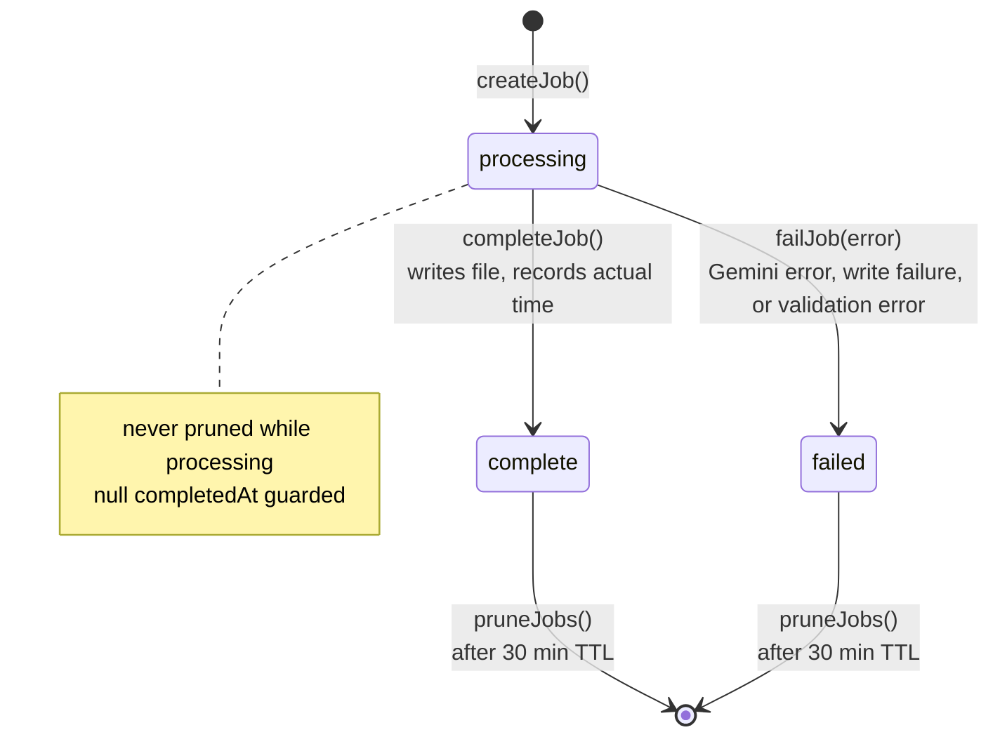
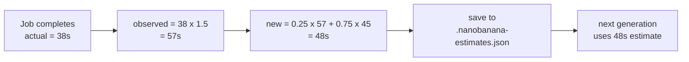
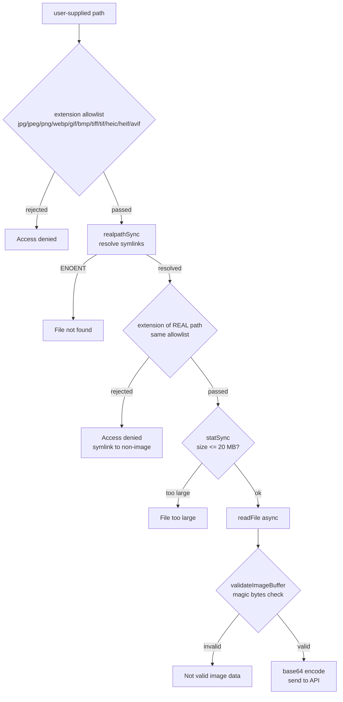
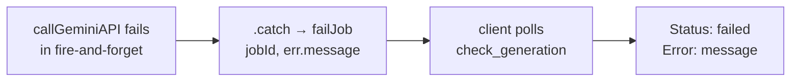
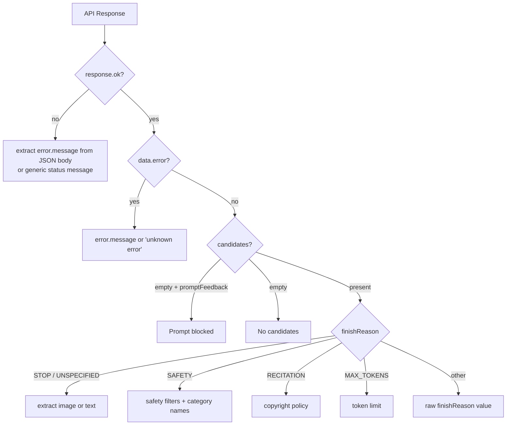

# Architecture

## Stack

| Layer | Technology |
|-------|-----------|
| Runtime | Node.js >= 18 (ships with Claude Desktop) |
| Protocol | MCP (Model Context Protocol) via stdio transport |
| Framework | `@modelcontextprotocol/sdk` — server, tool registration, JSON-RPC |
| Validation | `zod` v3 — tool input schemas |
| HTTP | Node.js built-in `fetch` — Gemini API calls |
| Bundling | `esbuild` — single-file ESM bundle for distribution |
| Distribution | MCPB (MCP Bundle) — `.mcpb` zip with manifest v0.4 |
| Testing | Node.js built-in `node:test` + `node:assert` — zero test dependencies |
| Security scanning | Semgrep (203 community rules) |

### Dependencies

**Production (2):** `@modelcontextprotocol/sdk`, `zod`
**Dev (1):** `esbuild`
**Everything else** is Node.js built-ins: `fs`, `fs/promises`, `path`, `crypto`, `url`, `os`

---

## System Architecture



### Project Structure

```
nanobananaMCPB/
├── manifest.json              # MCPB manifest v0.4 — identity, config, tool declarations
├── icon.png                   # Extension icon
├── server/
│   └── index.js               # Entire server — tools, API client, security, job queue
├── assets/
│   └── templates/             # 8 Visual DNA style presets (.json)
├── test/
│   ├── server.test.js         # Unit tests (87 tests)
│   ├── e2e.test.js            # MCP end-to-end via InMemoryTransport (17 tests)
│   ├── integration.test.js    # File-level integration (5 tests)
│   └── live.test.js           # Real Gemini API tests (10 tests, opt-in)
├── dist/
│   └── index.js               # esbuild bundle (production entry point)
├── ARCHITECTURE.md
├── TESTING.md
├── EXAMPLES.md
├── PRIVACY.md
└── README.md
```

---

## Data Flow

### Image Generation



### Image Editing



**Key difference from generate:** The job slot is reserved *before* `loadImageParts` (which awaits file I/O) to prevent race conditions in the concurrent job limit.

### Analysis Tools (extract_visual_dna, describe_image)



These are synchronous (not fire-and-forget) — the tool blocks until the API responds. Results go directly into context for chaining, not saved to files.

### Template Flow



---

## Async Generation Architecture

Image generation takes 10–135 seconds. The MCP client imposes a ~60s timeout. The server returns immediately and runs the API call in the background.

### Job State Machine



### Concurrency

- **MAX_CONCURRENT_JOBS = 5** — checked before `createJob`, rejected with error if exceeded
- **No locking needed** — Node.js single-threaded event loop; Promise `.then()` callbacks are microtasks processed sequentially
- **Unique filenames** — date + slug + 6-byte random hex prevents collisions across parallel jobs
- **Lazy pruning** — `pruneJobs()` runs on every `check_generation` call, removing settled jobs older than 30 minutes

---

## EMA Time Heuristic

The server estimates generation time per `image_size x thinking_level` so Claude can wait an informed interval before polling.

### Prior Estimates (seconds, includes 1.5x margin)

|          | `minimal` | `high` |
|----------|-----------|--------|
| **0.5K** | 20        | 30     |
| **1K**   | 30        | 45     |
| **2K**   | 50        | 75     |
| **4K**   | 90        | 135    |

### Self-Improvement



- **Alpha = 0.25** — each observation contributes 25% weight, smoothing outliers
- **Margin = 1.5x** — estimates target 150% of actual (overestimate is less disruptive than a missed poll)
- **Persists across restarts** — 8-cell table written to `OUTPUT_DIR/.nanobanana-estimates.json`
- **Schema-validated on load** — all sizes/levels must be numbers; `sampleCounts` also validated

---

## Security Architecture

### Image Loading Pipeline

Every image path passes through four checks before any bytes are read or sent:



### Magic Bytes Validation

| Format | Signature |
|--------|-----------|
| PNG | `89 50 4E 47` |
| JPEG | `FF D8 FF` |
| WebP | `RIFF....WEBP` (12 bytes) |
| GIF | `GIF8` |
| BMP | `BM` |
| TIFF | `II*\0` or `MM\0*` |
| HEIF/AVIF | `ftyp` at offset 4 + brand allowlist (`heic`/`heix`/`hevc`/`mif1`/`msf1`/`avif`/`avis`) at offset 8 |

### Other Security Measures

| Concern | Defense |
|---------|---------|
| API key leakage | Sent via `x-goog-api-key` header, never in URL |
| Error body reflection | Gemini error responses sanitized — extracts `error.message` only |
| Template path traversal | `isValidTemplateName` allowlist: `^[a-zA-Z0-9_-]+$` |
| Job queue DoS | `MAX_CONCURRENT_JOBS = 5` |
| `visual_dna` payload | Max 20 keys, 500 chars per value |
| Prototype pollution | `loadEstimates` validates both `table` and `sampleCounts` schemas |
| MCP log failures | `ctx.mcpReq.log` wrapped in try/catch — non-fatal |
| Empty HOME | Throws at startup if `HOME` and `USERPROFILE` both unset |

---

## Error Handling

### Immediate Errors (returned from tool call)

- Concurrent job limit exceeded
- `visual_dna` validation failure
- `loadImageParts` failure (extension, symlink, size, magic bytes, not found)
- Invalid template name / template not found

### Deferred Errors (discovered via polling)



Covers: safety blocks, recitation, max tokens, quota, network errors, disk write failures.

### Gemini Error Classification



---

## Configuration

Configured at install time via Claude Desktop's settings UI. Passed as environment variables by the MCPB runtime.

| Setting | Env var | Default |
|---------|---------|---------|
| Gemini API Key | `GEMINI_API_KEY` | required |
| Output Directory | `OUTPUT_DIR` | `~/Desktop/nanobanana-output` |
| Gemini Model | `GEMINI_MODEL` | `gemini-3.1-flash-image-preview` |
| Strip Image Metadata | `STRIP_METADATA` | `true` |

`OUTPUT_DIR` is evaluated lazily via `getOutputDir()` (not frozen at module load). Supports `${HOME}`, `$(HOME)`, and `~` prefixes that the MCPB runtime may pass through literally.

`STRIP_METADATA` controls automatic JPEG EXIF/IPTC stripping in `loadImageParts`. When enabled (default), APP1 (EXIF), APP13 (IPTC), and COM segments are removed from JPEG buffers before base64 encoding. Non-JPEG formats are passed through unchanged.

---

## Build and Distribution

```bash
npm run build     # esbuild → dist/index.js (ESM, Node.js externals)
npm run pack      # build + pack .mcpb archive
npm run validate  # validate manifest.json against MCPB schema
```

The esbuild bundle:
- Format: ESM (`--format=esm`, matches `"type": "module"`)
- Platform: Node.js (`--platform=node`)
- Externals: all `node:*` built-ins
- Banner: `createRequire` polyfill for CJS dependencies from the SDK

The `.mcpb` file is installed in Claude Desktop via **Settings > Extensions > Advanced settings > Install Extension**.
