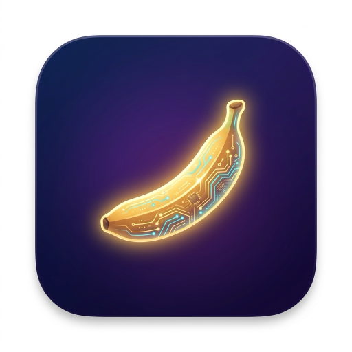

<p align="center">
  
</p>

<h1 align="center">Nanobanana Image Studio</h1>

<p align="center">
  <strong>MCPB extension for Claude Desktop &amp; Claude Cowork</strong><br>
  Generate, edit, and analyze images using Google's Nano Banana 2 model
</p>

<p align="center">
  <a href="https://github.com/OhJayGee/nanobanana2-mcpb/releases/latest"></a>
  <a href="LICENSE"></a>
  <a href="https://github.com/OhJayGee/nanobanana2-mcpb/releases/latest"></a>
  
  
</p>

---

## What is this?

A single-click installable extension that gives Claude the power to generate and edit images. It wraps Google's `gemini-3.1-flash-image-preview` model as MCP tools, so Claude can create visuals autonomously — product shots, marketing assets, style-consistent brand imagery, and more.

Built with the [MCPB](https://github.com/anthropics/mcpb) (MCP Bundles) format.

## Install

1. **Download** [`nanobananaMCPB.mcpb`](https://github.com/OhJayGee/nanobanana2-mcpb/releases/latest) from the latest release
2. Open Claude Desktop → **Settings → Extensions → Advanced settings → Install Extension**
3. Select the downloaded `.mcpb` file and confirm
4. **Configure** your [Google AI Studio API key](https://aistudio.google.com/apikey) and output directory when prompted

No Node.js install needed — Claude Desktop bundles everything.

## Updating

Download the latest `.mcpb` from the [releases page](https://github.com/OhJayGee/nanobanana2-mcpb/releases/latest) and follow the same install path: **Settings → Extensions → Advanced settings → Install Extension**. Claude Desktop updates the extension in-place — no uninstall needed.

## Tools

| Tool | Description |
|------|-------------|
| `generate_image` | Queue text-to-image generation — returns immediately with a `job_id` |
| `edit_image` | Queue image editing — returns immediately with a `job_id` |
| `check_generation` | Poll a queued job for status, elapsed time, and output file details |
| `extract_visual_dna` | Reverse-engineer an image's aesthetics into structured JSON |
| `describe_image` | Generate a detailed text description of any image |
| `list_templates` | Browse 8 built-in Visual DNA style templates |
| `get_template` | Retrieve a template's JSON for use with `generate_image` |

## Quick Examples

### Generate an image

> "Create a hero image for our headphones product page"

Generation runs asynchronously — `generate_image` returns immediately with a `job_id`, then Claude polls `check_generation` until the file is ready (typically 10–90 seconds depending on resolution and thinking level).

```
1. generate_image({
     "prompt": "Premium wireless headphones floating on a dark gradient, dramatic product lighting",
     "aspect_ratio": "16:9",
     "image_size": "2K",
     "thinking_level": "high"
   })
   → job_id: a1b2c3, output_path: ~/Desktop/nanobanana-output/2026-03-27-premium-headphones-a1b2c3.png
     Estimated time: ~75s

2. check_generation({ "job_id": "a1b2c3" })
   → Status: complete | Actual: 61s | File: ...premium-headphones-a1b2c3.png (1.8 MB)
```

### Style consistency with Visual DNA

Extract the aesthetic DNA from a reference image, then apply it to new subjects:

```
1. extract_visual_dna({ images: ["/path/to/brand-photo.jpg"] })
   → { "style": "...", "lighting": "...", "camera": "...", ... }

2. generate_image({
     prompt: "A smart water bottle with LED display",
     visual_dna: { ...extracted DNA... }
   })
   → New image matching the original brand aesthetic
```

### Edit an existing image

```json
{
  "images": ["/path/to/portrait.jpg"],
  "prompt": "Replace the background with a golden sunset beach scene, keep the subject as-is",
  "thinking_level": "high"
}
```

### Use a built-in template

```
1. list_templates()
   → cinematic_fujifilm, blueprint_3d, noir_dramatic, vintage_polaroid, ...

2. get_template({ name: "noir_dramatic" })
   → { "style": "Film noir, high contrast black and white, ..." }

3. generate_image({
     prompt: "A detective under a streetlight in a rain-soaked alley",
     visual_dna: { ...noir template... }
   })
```

### Autonomous workflows (Claude Cowork)

Claude chains tools automatically. Both `generate_image` calls are queued immediately, then Claude polls both jobs until complete before drafting the email:

```
User: "Create a product launch email with custom images"

Claude:
  1. generate_image → hero banner (16:9, 2K)      → job_id: abc
  2. generate_image → lifestyle product shot (4:3) → job_id: def
  3. check_generation(abc) → complete (61s)
  4. check_generation(def) → complete (38s)
  5. describe_image → alt text for accessibility
  6. gmail_create_draft → compose email with images attached
```

See [EXAMPLES.md](EXAMPLES.md) for more detailed examples.

## Visual DNA Templates

8 pre-built style templates ready to use:

| Template | Style |
|----------|-------|
| `cinematic_fujifilm` | Film-like cinematic, golden hour, warm tones |
| `blueprint_3d` | Technical blueprint, orthographic projection |
| `product_photography` | Clean e-commerce ready, white background |
| `watercolor_illustration` | Hand-painted feel, soft washes |
| `flat_vector` | Modern minimalist, geometric shapes |
| `noir_dramatic` | Film noir, high contrast B&W |
| `isometric_3d` | Game art style, isometric diorama |
| `vintage_polaroid` | Nostalgic instant film, faded tones |

## Configuration

Set during installation via Claude Desktop's settings UI:

| Setting | Description | Default |
|---------|-------------|---------|
| **Gemini API Key** | Your Google AI Studio API key | *(required)* |
| **Output Directory** | Where generated images are saved | `~/Desktop/nanobanana-output` |
| **Gemini Model** | Model ID (change when GA) | `gemini-3.1-flash-image-preview` |
| **Strip Image Metadata** | Strip EXIF/IPTC from JPEGs before sending to API | `true` |

## Parameters

### Aspect Ratios

`1:1` `16:9` `9:16` `4:3` `3:4` `21:9` `4:5` `5:4` `1:4` `4:1` `1:8` `8:1` `2:3` `3:2`

### Image Sizes

`0.5K` (512px) · `1K` (1024px, default) · `2K` (2048px) · `4K` (4096px)

### Thinking Levels

| Level | Use for |
|-------|---------|
| `minimal` | Fast generation, simple compositions |
| `high` (default) | Complex scenes, text in images, precise prompt adherence |

## Development

```bash
git clone https://github.com/OhJayGee/nanobanana2-mcpb.git
cd nanobanana2-mcpb
npm install
npm test          # Run 109 unit + e2e tests
npm run scan      # Semgrep security scan (203 rules)
npm run build     # Bundle with esbuild
npm run pack      # Build + pack .mcpb
```

## Documentation

| Document | Description |
|----------|-------------|
| [ARCHITECTURE.md](ARCHITECTURE.md) | System architecture, data flow diagrams, async job queue, security model, EMA heuristic |
| [TESTING.md](TESTING.md) | Test structure (unit, e2e, integration, live), coverage details, security test matrix |
| [EXAMPLES.md](EXAMPLES.md) | Detailed usage examples and workflow patterns |
| [PRIVACY.md](PRIVACY.md) | Privacy policy — what data is sent to Google's Gemini API |

## Privacy

This extension sends prompts and images to Google's Gemini API for processing. Your API key is stored locally in the OS keychain. See [PRIVACY.md](PRIVACY.md) for full details.

## License

[MIT](LICENSE) — Copyright 2026 OhJayGee
