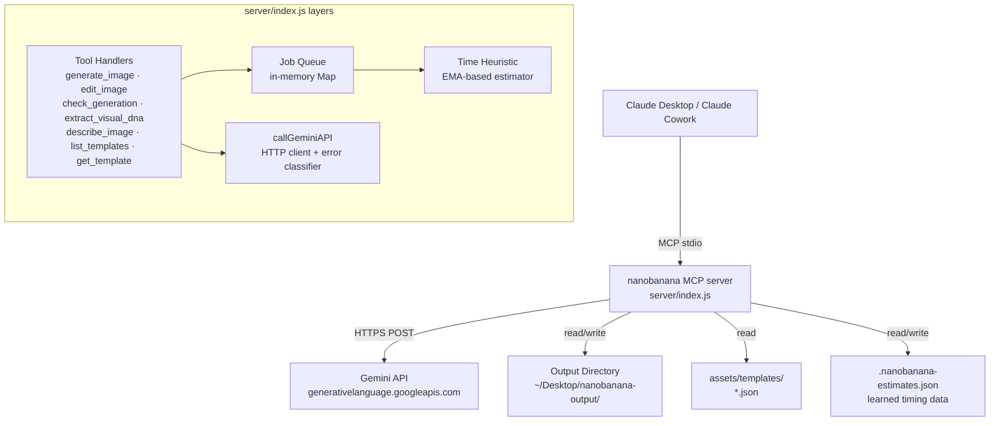
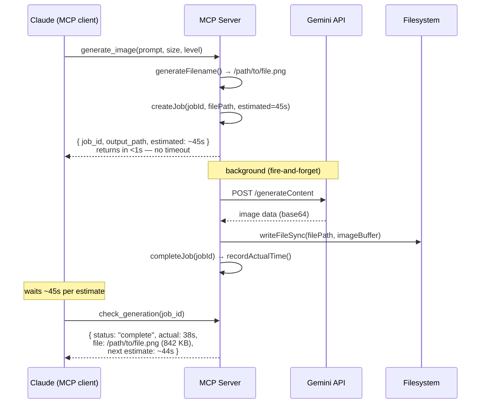
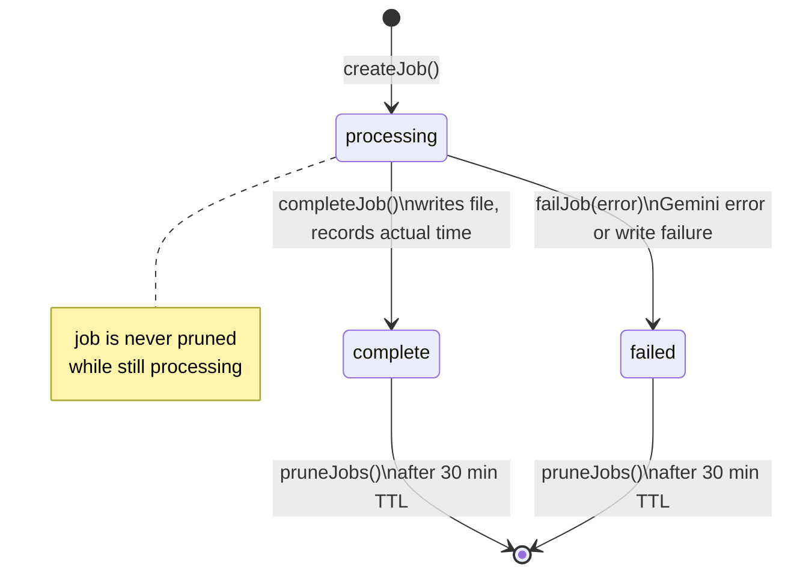
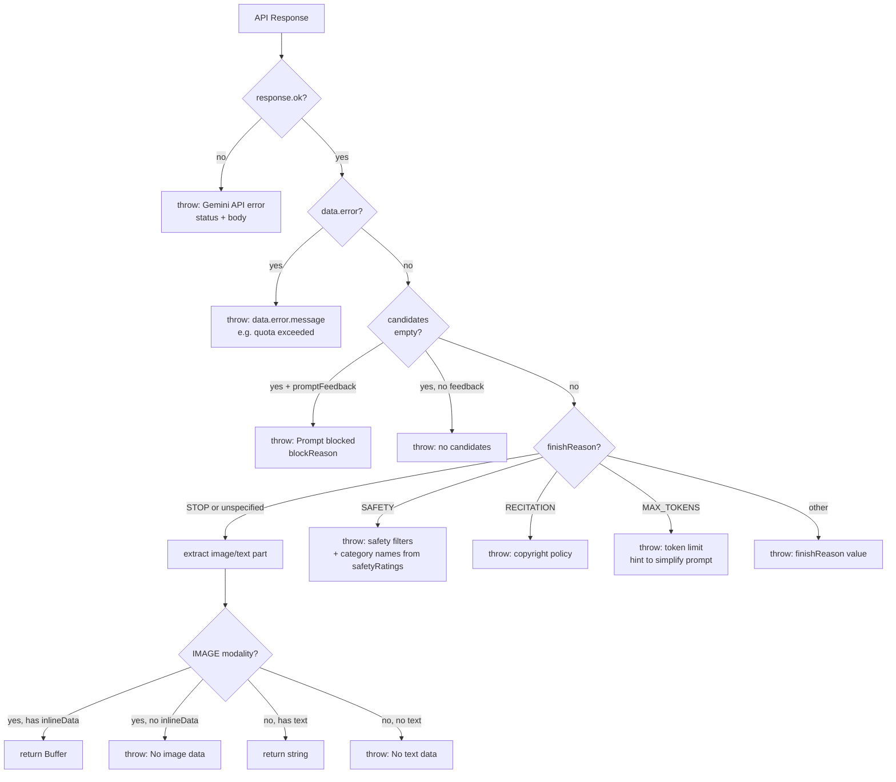
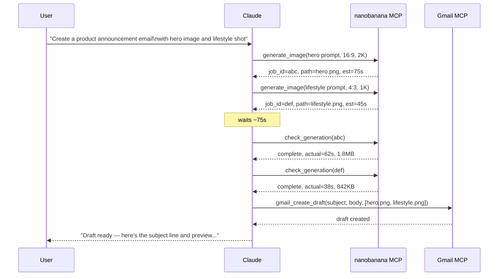

# Nanobanana MCPB Extension — Design Spec

## Overview

A Node.js-based MCPB (MCP Bundle) extension that re-implements the nanobanana Rust CLI as a set of MCP tools for Claude Desktop and Claude Cowork. The extension exposes image generation, editing, visual DNA extraction, and description capabilities via Google's Nano Banana 2 model (`gemini-3.1-flash-image-preview`).

## Motivation

The existing nanobanana-cli is a Rust binary invoked from the command line. Repackaging its functionality as an MCPB extension enables:

- Single-click installation in Claude Desktop/Cowork
- Autonomous multi-step workflows (e.g., generate images then compose emails)
- User-configurable API key and output directory via Claude Desktop's settings UI
- No external binary dependency — pure Node.js using built-in `fetch`

---

## System Architecture



### Bundle Structure

```
nanobananaMCPB/
├── manifest.json              # MCPB manifest (v0.4)
├── icon.png                   # Extension icon (512x512)
├── server/
│   └── index.js               # MCP server — all tools + Gemini client
├── assets/
│   └── templates/
│       ├── cinematic_fujifilm.json
│       └── blueprint_3d.json
├── test/
│   ├── server.test.js         # Unit tests (helpers, API client, job queue, heuristic)
│   └── integration.test.js    # Integration tests (templates, loadImageParts)
├── dist/
│   └── index.js               # esbuild bundle (generated)
└── package.json
```

### Dependencies

- `@modelcontextprotocol/sdk` — MCP server framework
- `zod` (v3) — input schema validation
- Node.js built-in `fetch` (>= 18) — HTTP client
- Node.js built-in `fs`, `path`, `crypto`, `Buffer` — file I/O and base64

No other runtime dependencies.

### Runtime Requirements

- Node.js >= 18 (ships with Claude Desktop)
- macOS (darwin) and Windows (win32)

---

## Async Generation Architecture

Image generation via Gemini can take 10–135 seconds. Claude Desktop's MCP client imposes a ~60s timeout on tool calls. To avoid timeouts, `generate_image` and `edit_image` return immediately and run the API call in the background.

### Request / Poll Flow



### Job State Machine



### Job Record Structure

```javascript
{
  status: "processing" | "complete" | "failed",
  filePath: "/path/to/2026-03-27-a-cat-ab12cd.png",
  prompt: "a cat in a forest",
  image_size: "1K",
  thinking_level: "high",
  estimatedSeconds: 45,
  startedAt: 1743076800000,   // Date.now() at queue time
  completedAt: 1743076838400, // Date.now() at completion (null while processing)
  error: null                 // error message string on failure
}
```

---

## Generation Time Heuristic

The server estimates how long a generation will take based on `image_size` × `thinking_level`, so Claude can wait an informed interval before polling rather than checking immediately.

### Estimate Table (seconds, includes ×1.5 margin)

|          | `minimal` | `high` |
|----------|-----------|--------|
| **0.5K** | 20s       | 30s    |
| **1K**   | 30s       | 45s    |
| **2K**   | 50s       | 75s    |
| **4K**   | 90s       | 135s   |

### Self-Improvement via EMA

```mermaid
flowchart LR
    A[Job completes\nactual = 38s] --> B[observed = actual × 1.5\n= 57s]
    B --> C[new_estimate = 0.25 × 57\n+ 0.75 × 45\n= 47.75 → 48s]
    C --> D[sampleCounts\n1K/high: N+1]
    D --> E[saveEstimates()\n→ .nanobanana-estimates.json]
    E --> F[next generate_image\nuses 48s estimate]
```

- **Alpha = 0.25** — each observation contributes 25% weight; stable against outliers
- **Margin factor = 1.5** — estimates always target `actual × 1.5` to stay conservative
- **Persists across restarts** — learned values written to `OUTPUT_DIR/.nanobanana-estimates.json` after every completed job
- **File is fixed size** — always 4×2 = 8 number cells; grows no larger regardless of usage

### Estimates File Format

```json
{
  "table": {
    "0.5K": { "minimal": 18, "high": 27 },
    "1K":   { "minimal": 28, "high": 44 },
    "2K":   { "minimal": 50, "high": 75 },
    "4K":   { "minimal": 90, "high": 135 }
  },
  "samples": {
    "1K": { "high": 7, "minimal": 3 }
  }
}
```

---

## Gemini API Client

One internal function shared by all image/text tools:

```
callGeminiAPI({ parts, modalities, thinkingLevel, includeThoughts })
  → { type: 'image', data: Buffer } | { type: 'text', data: string }
```

### Request Structure

```json
{
  "contents": [{ "parts": [...imageParts, { "text": "..." }] }],
  "generationConfig": {
    "responseModalities": ["IMAGE" | "TEXT"],
    "candidateCount": 1,
    "thinkingConfig": {
      "includeThoughts": true,
      "thinkingLevel": "minimal" | "high"
    }
  }
}
```

**Endpoint:** `https://generativelanguage.googleapis.com/v1beta/models/{GEMINI_MODEL}:generateContent?key={GEMINI_API_KEY}`

### Error Classification



**Timeout:** No server-side timeout. The MCP client manages connection lifecycle; the server relies on Node.js `fetch` defaults. Progress is communicated via `ctx.mcpReq.log()` notifications.

---

## Tools

### generate_image

Queue image generation from a text prompt. Returns immediately with `job_id` and planned output path.

| Parameter | Type | Default | Description |
|---|---|---|---|
| `prompt` | string | required | Text description |
| `style` | string | — | Artistic style instruction |
| `visual_dna` | object | — | DNA JSON for style consistency |
| `aspect_ratio` | enum | `"1:1"` | 14 ratios supported |
| `image_size` | enum | `"1K"` | 0.5K / 1K / 2K / 4K |
| `thinking_level` | enum | `"high"` | minimal / high |

**Returns:**
```
Image generation queued.
job_id: a1b2c3d4e5f6
output_path: /…/2026-03-27-a-cat-ab12cd.png
Estimated time: ~45s — check back with check_generation(job_id) after that interval.
```

### edit_image

Queue image editing. Validates input images synchronously (fast fail on bad paths) before queuing.

| Parameter | Type | Default | Description |
|---|---|---|---|
| `images` | string[] (1–14) | required | Input file paths |
| `prompt` | string | required | Edit instruction |
| `aspect_ratio` | enum | `"1:1"` | — |
| `image_size` | enum | `"1K"` | — |
| `thinking_level` | enum | `"high"` | — |

### check_generation

Poll for completion of a queued job.

| Parameter | Type | Description |
|---|---|---|
| `job_id` | string (optional) | Job to check. Omit to list all active jobs. |

**Responses by status:**

- `processing` — elapsed time, estimated remaining, output path
- `complete` — actual time vs estimate, file path + size, updated estimate for next run
- `failed` — elapsed time, error message

Jobs are automatically pruned 30 minutes after completion. Processing jobs are never pruned.

### extract_visual_dna

Extract a structured JSON object from images. Fields: `style`, `scene`, `subject`, `camera`, `lighting`, `materials`, `colors`. Returns result inline (not saved to file — for in-context chaining). Uses `thinkingLevel: "minimal"`.

### describe_image

Generate a detailed text description of images. Returns inline. Uses `thinkingLevel: "minimal"`.

### list_templates

List all `.json` files in `assets/templates/`, showing name and `style` field.

### get_template

Return the full JSON of a named template. Name is validated by `isValidTemplateName()` to reject path traversal attempts (`/`, `\`, `..`).

---

## Parallelism and Safety

**Concurrent generations** are fully safe. Each job gets a unique `jobId` (6-byte random hex) and `filePath` (date + prompt slug + 6-byte hex), so 10 parallel `generate_image` calls produce 10 independent jobs with no collisions.

**No locking needed** on the job Map or estimates file. Node.js is single-threaded: Promise `.then()` callbacks are microtasks processed sequentially on the event loop. `writeFileSync` is synchronous, so file writes are naturally serialized even when multiple jobs complete near-simultaneously.

**Memory** — the job Map grows during a session but is bounded in practice. Completed and failed jobs older than 30 minutes are lazily pruned on each `check_generation` call.

---

## File Naming

```
{YYYY-MM-DD}-{slug}-{hex}.png
```

- Date prefix for chronological sorting
- Slug: first 40 chars of prompt, lowercased, non-alphanumeric → hyphens, trailing hyphens stripped
- 6-char random hex suffix to prevent collisions
- Always `.png` (Gemini returns PNG)

Output directory is created on first use (`mkdirSync({ recursive: true })`).

---

## Manifest

```json
{
  "manifest_version": "0.4",
  "name": "nanobanana",
  "version": "1.0.0",
  "display_name": "Nanobanana Image Studio",
  "description": "Generate, edit, and analyze images using Nano Banana 2",
  "author": { "name": "OhJayGee" },
  "license": "MIT",
  "server": {
    "type": "node",
    "entry_point": "server/index.js",
    "mcp_config": {
      "command": "node",
      "args": ["${__dirname}/server/index.js"],
      "env": {
        "GEMINI_API_KEY": "${user_config.gemini_api_key}",
        "OUTPUT_DIR": "${user_config.output_directory}",
        "GEMINI_MODEL": "${user_config.gemini_model}"
      }
    }
  },
  "user_config": {
    "gemini_api_key": { "type": "string", "sensitive": true, "required": true },
    "output_directory": { "type": "directory", "default": "${HOME}/Desktop/nanobanana-output" },
    "gemini_model": { "type": "string", "default": "gemini-3.1-flash-image-preview" }
  }
}
```

---

## Testing

51 tests across 14 suites. Run with: `npm test` (`NANOBANANA_TEST=1` prevents server startup during tests).

| Suite | What's covered |
|---|---|
| `slugify` | Lowercasing, hyphen collapsing, trailing hyphen strip, 40-char truncation edge case |
| `detectMimeType` | .png, .PNG, .webp, defaults |
| `generateFilename` | Format regex |
| `estimateSeconds` | Size ordering, thinking level ordering, unknown param fallback |
| `job queue` | Create/complete/fail lifecycle, `completedAt` timestamps, null for unknown id, list all, TTL pruning |
| `job queue edge cases` | `completeJob`/`failJob` no-op on unknown id |
| `recordActualTime` | EMA pulls estimate toward observed, sample count increments, valid size + unknown level, unknown size |
| `isValidTemplateName` | Accepts normal names, rejects `/`, `\`, `..` |
| `loadImageParts success` | Returns correct `mimeType` and base64 for real file |
| `loadEstimates / saveEstimates` | Round-trip read/write, silent ignore on missing file, silent ignore on corrupt JSON |
| `callGeminiAPI` | Missing API key, request body structure, TEXT result, IMAGE result, non-2xx, `data.error` on 200, empty candidates (with/without `promptFeedback`), `SAFETY` with category names, `RECITATION`, `MAX_TOKENS`, unexpected `finishReason`, IMAGE with no `inlineData`, TEXT with no `text` part |
| `integration: templates` | Directory exists, ≥2 templates, each has `style` field |
| `integration: loadImageParts` | Empty array, non-existent file, >14 images |

---

## Autonomous Workflow Example



## Style Consistency Workflow

```
1. extract_visual_dna({ images: ["/path/to/brand-reference.jpg"] })
   → { "style": "...", "lighting": "...", ... }

2. generate_image({ prompt: "Product shot", visual_dna: { ...DNA... } })
   → consistent brand aesthetic

3. generate_image({ prompt: "Lifestyle shot", visual_dna: { ...same DNA... } })
   → same aesthetic, different subject
```

---

## Design Decisions

- **Async queue over synchronous execution** — Gemini takes 10–135s; MCP client timeout is ~60s. Returning `job_id` immediately sidesteps this completely without requiring any MCP protocol changes.
- **EMA over simple average** — smooths outliers (network jitter, cold starts) while still converging toward real performance over time.
- **Margin factor 1.5× on estimates** — users and Claude should wait slightly longer than average, not exactly average. A 10s overestimate is less disruptive than a missed poll.
- **Lazy pruning on `check_generation`** — no background timers or intervals; cleanup happens naturally when the tool is used.
- **`writeFileSync` over async write** — called from inside `.then()` microtasks which are single-threaded; sync is safe and avoids additional async state management.
- **Gemini provider only** — keeps user_config to one API key. Vertex AI support can be added later as a `provider` toggle.
- **Text output returned inline** — `extract_visual_dna` and `describe_image` results go directly into context for chaining, rather than being saved to files.

## Deviations from Rust CLI

- **Async queue protocol** — Rust CLI blocks until complete; MCP version returns immediately with polling mechanism.
- **"colors" field in Visual DNA** — Rust CLI extracts 6 fields; this adds `colors` as a 7th, matching actual model output.
- **No `visual_dna` file path** — Rust CLI accepts `--visual-dna` as a file path; MCP passes the object directly from a prior tool call.
- **Enum validation** — Rust CLI accepts freeform strings for `aspect_ratio`/`image_size`; MCP validates as enums for better error messages.
