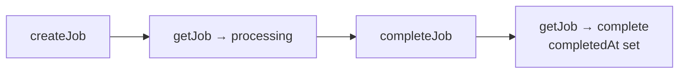

# Nanobanana MCPB — Test Documentation

## Running Tests

```bash
npm test
```

Uses Node.js native `node:test` runner. The `NANOBANANA_TEST=1` env var prevents the MCP server from starting during tests (the `if (!process.env.NANOBANANA_TEST)` guard in `server/index.js`).

**Current state:** 51 tests, 14 suites, 0 failures.

---

## Test Structure

```
test/
├── server.test.js       # Unit tests — helpers, job queue, heuristic, API client
└── integration.test.js  # Integration tests — template files, image loading
```

### What each file covers

| File | Focus |
|---|---|
| `server.test.js` | Pure logic, no filesystem side effects (except persistence tests which use `tmpdir`) |
| `integration.test.js` | Touches real files on disk (template JSONs, temp image file) |

---

## Test Suites

### `slugify` — 5 tests

`slugify(text)` converts a prompt into a filename-safe slug.

| Test | What it verifies |
|---|---|
| lowercases and replaces non-alphanumeric with hyphens | `"A Cyberpunk Forest!" → "a-cyberpunk-forest"` |
| truncates to 40 chars | Output length ≤ 40 |
| collapses consecutive hyphens | `"hello---world" → "hello-world"` |
| strips leading and trailing hyphens | `"--hello--" → "hello"` |
| handles truncation that lands on a hyphen | 39 chars + space does not produce a trailing hyphen |

**Edge case reasoning:** The 40-char slice can land in the middle of a hyphen sequence. The final `.replace(/-+$/, "")` cleans it up.

---

### `detectMimeType` — 4 tests

`detectMimeType(filePath)` returns the MIME type from a file extension.

| Test | Input | Expected |
|---|---|---|
| .png | `photo.png` | `image/png` |
| .PNG (case insensitive) | `photo.PNG` | `image/png` |
| .webp | `photo.webp` | `image/webp` |
| defaults to jpeg | `photo.jpg`, `photo.bmp` | `image/jpeg` |

---

### `generateFilename` — 1 test

`generateFilename(prompt)` produces `YYYY-MM-DD-slug-hex.png`.

Verified with regex: `/^\d{4}-\d{2}-\d{2}-a-cool-image-[0-9a-f]{6}\.png$/`

---

### `estimateSeconds` — 3 tests

`estimateSeconds(image_size, thinking_level)` returns the current estimated generation time in seconds.

| Test | What it verifies |
|---|---|
| larger sizes have higher estimates | `4K/high > 1K/high`, `2K/minimal > 0.5K/minimal` |
| `high` thinking level is slower than `minimal` | For all 4 sizes |
| fallback for unknown params | Returns a positive number (45) |

---

### `job queue` — 5 tests

Tests the in-memory job lifecycle.



| Test | What it verifies |
|---|---|
| creates, completes, and retrieves a job | All fields set correctly; `completedAt` set on complete |
| tracks failed jobs with completedAt | `status: "failed"`, `error` message, `completedAt` set |
| returns null for unknown job | `getJob("nonexistent") === null` |
| lists all jobs | `getAllJobs()` contains created job |
| pruneJobs removes old finished jobs | Old complete job deleted; recent complete kept; processing job kept regardless of age |

---

### `job queue edge cases` — 2 tests

| Test | What it verifies |
|---|---|
| `completeJob` on unknown id is a no-op | Does not throw; `getJob` still returns null |
| `failJob` on unknown id is a no-op | Does not throw; `getJob` still returns null |

---

### `recordActualTime` — 4 tests

`recordActualTime(image_size, thinking_level, actualSeconds)` updates the EMA-based estimate table and increments the sample counter.

| Test | What it verifies |
|---|---|
| updates estimate toward observed value via EMA | A very fast actual time pulls the estimate down |
| increments sample count | `getSampleCount` returns `before + 1` |
| ignores unknown `image_size` gracefully | No throw when size not in table |
| valid size + unknown `thinking_level` | Hits the second guard (`current === undefined`), no throw |

**Why two "ignores unknown" tests?** There are two early-return guards in `recordActualTime`:
1. `if (!estimateTable[image_size]) return` — unknown size
2. `if (current === undefined) return` — known size, unknown level

The second guard is only reached when the first passes. Both are tested independently.

---

### `isValidTemplateName` — 4 tests

`isValidTemplateName(name)` prevents path traversal in `get_template`.

| Test | Input | Expected |
|---|---|---|
| accepts normal names | `"cinematic_fujifilm"`, `"my-template"` | `true` |
| rejects forward slash | `"../../etc/passwd"`, `"foo/bar"` | `false` |
| rejects backslash | `"foo\\bar"` | `false` |
| rejects double dot | `"..hidden"` | `false` |

---

### `loadImageParts success path` — 1 test

`loadImageParts([filePath])` reads a file and returns it as a base64-encoded `inlineData` part.

Creates a temporary PNG file in `tmpdir()`, calls `loadImageParts`, verifies:
- `parts.length === 1`
- `parts[0].inlineData.mimeType === "image/png"`
- `parts[0].inlineData.data` matches `buffer.toString("base64")`

Cleans up the temp file after the test.

---

### `loadEstimates / saveEstimates` — 3 tests

Tests the persistence layer for learned timing data. Uses a temp directory to avoid mutating real output.

| Test | What it verifies |
|---|---|
| round-trip read/write | Write fixture JSON, call `loadEstimates()`, verify `estimateSeconds` and `getSampleCount` return loaded values |
| silently ignores missing file | No throw when estimates file doesn't exist |
| silently ignores corrupt JSON | No throw when file contains invalid JSON |

**How it works:** Tests temporarily override `process.env.OUTPUT_DIR` to point at a `tmpdir()` subdirectory, then restore it after each case.

---

### `callGeminiAPI` — 13 tests

`callGeminiAPI()` is tested exclusively with a mocked `globalThis.fetch`. Tests save and restore the original `fetch` in `finally` blocks.


| Test | Scenario | Error message pattern |
|---|---|---|
| missing API key | `GEMINI_API_KEY` deleted | `/GEMINI_API_KEY/` |
| request body structure | Captures and inspects body | Fields match exactly |
| TEXT result | `candidates[0].content.parts[0].text` | `result.type === "text"` |
| IMAGE result | `candidates[0].content.parts[0].inlineData` | `result.type === "image"`, is Buffer |
| non-2xx | `ok: false, status: 400` | `/400/` |
| `data.error` on 200 OK | `{ error: { message: "quota exceeded" } }` | `/quota exceeded/` |
| empty candidates, no feedback | `candidates: []` | `/no candidates/` |
| `promptFeedback` block | `promptFeedback: { blockReason: "SAFETY" }` | `/Prompt blocked/` |
| `SAFETY` finishReason | `finishReason: "SAFETY"`, `safetyRatings` with `HARM_CATEGORY_SEXUALLY_EXPLICIT` | `/safety filters.*sexually explicit/i` |
| `RECITATION` finishReason | `finishReason: "RECITATION"` | `/copyright/i` |
| `MAX_TOKENS` finishReason | `finishReason: "MAX_TOKENS"` | `/token limit/` |
| unexpected finishReason | `finishReason: "BLOCKLIST"` | `/BLOCKLIST/` |
| IMAGE, no `inlineData` | `parts: [{ text: "oops" }]` | `/No image data/` |
| TEXT, no `text` part | `parts: [{ inlineData: { data: "x" } }]` | `/No text data/` |

---

### `integration: template files exist` — 2 tests

Reads real files from `assets/templates/`.

| Test | What it verifies |
|---|---|
| templates directory has at least 2 templates | Directory exists, ≥ 2 `.json` files |
| each template is valid JSON with a `style` field | Parses each file, checks `content.style` is truthy |

---

### `integration: loadImageParts validation` — 3 tests

| Test | Input | Error pattern |
|---|---|---|
| empty array | `[]` | `/at least one/` |
| non-existent file | `["/nonexistent/fake.png"]` | `/not found/` |
| more than 14 images | `Array(15).fill("/fake.png")` | `/14/` |

---

## Security Scanning

Semgrep is configured as a security scanner and runs 203 rules (156 JS-specific + 47 multi-language) from the community registry.

```bash
npm run scan
# equivalent to: semgrep --config=auto server/index.js
```

**Current state:** 0 findings.

Re-run whenever:
- New tools are added (new user input surface)
- `callGeminiAPI` or file I/O logic changes
- Dependencies are updated

Notable rule categories applied: injection patterns, prototype pollution, insecure `fetch` usage, path traversal, unsafe `JSON.parse`, credential exposure in logs.

Semgrep does not replace the path-traversal guard in `isValidTemplateName()` — that is intentional defence-in-depth: validate at the application boundary, scan at the source level.

---

## What Is Not Unit Tested

The MCP tool handlers (`generate_image`, `edit_image`, `check_generation`, etc.) live inside the `if (!process.env.NANOBANANA_TEST)` block and are not reachable from tests. Their logic is covered indirectly through the exported functions they call. End-to-end tool behaviour should be verified via the MCP inspector or Claude Desktop.

The `get_template` path traversal check was previously inside the server block (untestable). It was extracted into `isValidTemplateName()` which is exported and fully tested.
